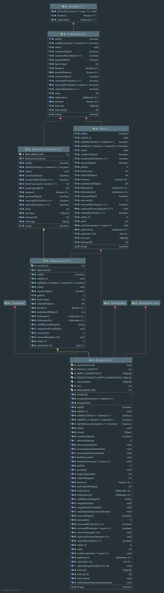

## ArrayList
### 类关系

可以看到ArrayList实现了 RandomAccess 接口、Cloneable接口、Serializable接口，继承了AbstractList抽象类
简单说明一下这几个接口
* RandomAccess接口：官方说法，其为一个标识型的接口，如果某个类实现了该接口，那么表示该类支持高性能的随机访问，也就是遍历使用的for循环而非iterator迭代器；
* Cloneable接口：该接口也是标识型的接口，用于标识在调用该类对象的clone方法是合法的，若没有实现该接口，则在触发clone方法时会抛出
  CloneNotSupportedException 异常，这里还会引出一个额外的知识点，关于对象的浅拷贝和深拷贝，简单理解浅拷贝就是将对象中的所有属性的值或者引用拷贝一份，深拷贝就是将对象中的属性根据其类型重新new一个新的属性
* Serializable接口：标识型接口，用于表示该类对象是否能够被序列化，详细来说，如果某个对象中的属性未实现该接口，那么在序列化过程中，该属性对象的生成会直接调用其空参数的构造方法进行实例化，其他实现了该接口的属性对象则会从序列数据中生成

继承的AbstractList抽象类是对于集合Collection下的List组件的抽象封装
从顶层的类开始
* Iterable接口： 实现该接口的类，其对象可以作为 for-each 循环的目标，也就是可以使用 forEach(Consumer<? super T> action) 方法;
该类还包含方法iterator（用于获取迭代器），spliterator（用于获取可分割迭代器，并行迭代元素用）

### 类说明

* 属性
ArrayList类包括属性 
  * serialVersionUID 序列化标识，用于在类对象序列化时区分是否为同一版本的类
  * DEFAULT_CAPACITY 数组的默认初始化大小 10
  * EMPTY_ELEMENTDATA 一个用来保存空元素的数组，专用于表示空的集合，一般是当size==0时就会替换成EMPTY_ELEMENTDATA
  * DEFAULTCAPACITY_EMPTY_ELEMENTDATA 一个用于保存默认数量元素的集合，也就是使用size==10的时候
  * elementData 集合中的元素缓存数组，非私有变量，便于子类访问，elementData的大小也就是当前使用的ArrayList的大小
  * size 当前ArrayList的大小（其包含元素的个数）
  * MAX_ARRAY_SIZE 最大容量，超过后抛出 OutOfMemoryError 值为 Integer.MAX_VALUE - 8，该值的设置是为了应对某些虚拟机会保留8个字节的长度作为头部空间

